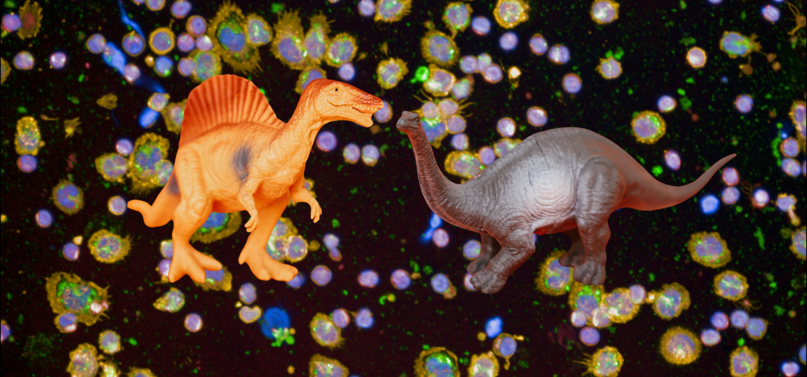
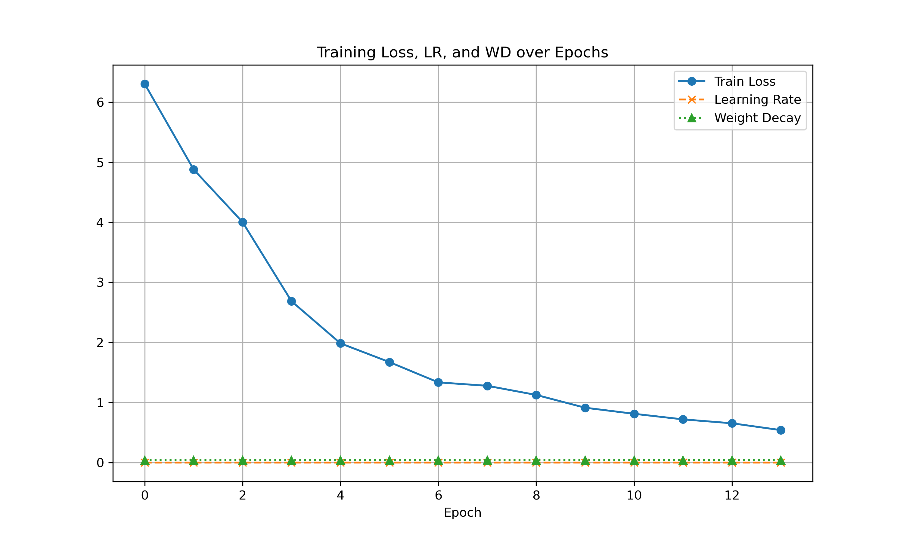
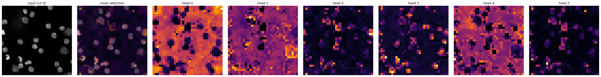
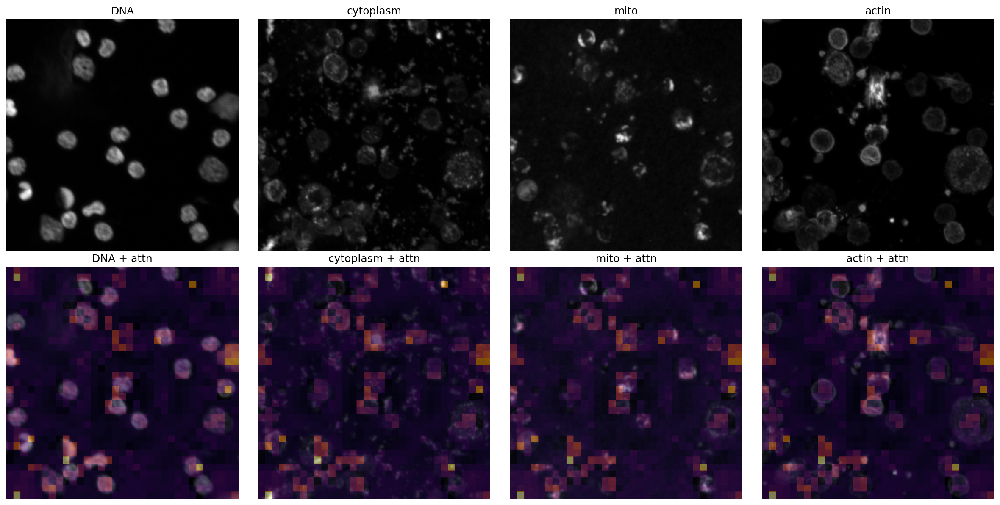
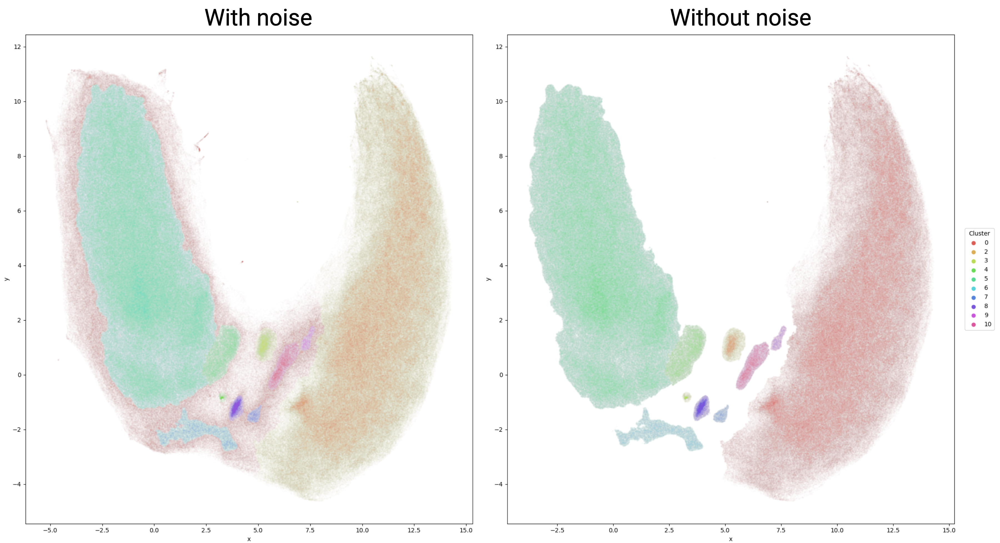
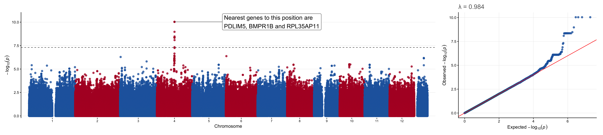

# Blood Cell Painting DINO (DinoBCP)

Self-supervised DINO architecture modified for [Blood Cell Painting](https://www.biorxiv.org/content/10.1101/2024.05.17.594648v3) images.
Blood Cell Painting is in collaboration with FIMM, Finnish Red Cross Blood Service and FinnGen.
The code builds upon / is inspired by [scDINO](https://github.com/JacobHanimann/scDINO) and [Joona Pohjonen](https://github.com/jopo666)'s code, as well as [DINO](https://github.com/facebookresearch/dino) from Facebook.
This is a work in progress, and does not yet include all code required to run it.

## Workflow
Samples from blood donors were extracted as explained in the Blood Cell Painting paper, and imaged by a confocal microscope.

Flattened images were tiled to 540x540, numpy arrays of 4x540x540 created with all channels except brightfield, and the model was taught with them for 13 epochs, with batch size = 64 and vit_small. The main code also uses gradient accumulation and BN for the DINOHead.
Batch effects were removed from the features after training by:
- Scaling to controls and standardizing data to mean = 0 and std = 1
- Applying [Harmony](https://www.nature.com/articles/s41592-019-0619-0) correction for plate and well

For the extracted DINO features, clustering was done by HDBSCAN.
PCA was used to extract final principal components for GWAS analysis, as in Blood Cell Painting.

## Preliminary results
The training loss of the model.

Some attention heads focus more on the background, and some on the cells.

Attention channels with mean attention overlaid show the averaged focus falls on cells.

Clustering results from HDBSCAN show two major clusters and multiple smaller ones.

Running GWAS for FinnGen donors revealed associations between certain genomic regions and clusters created by the DinoBCP.
These associations have not been confirmed, and are preliminary.

The Manhattan plot reveals genome-wide significant associations (5e-8) at multiple loci.

